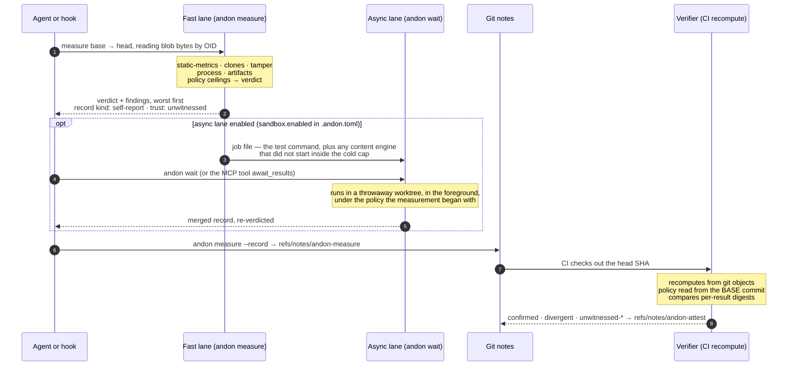

# Andon

**Code measurement that carries its evidence — and a self-report an independent
recompute can check.**

An agent changes code. Andon measures the change and returns a verdict — `pass`,
`advise`, `block`, or `escalate_to_human` — where every number stands on a named
claim, every claim says what it does **not** predict, and the whole record is written
into git so that something the agent does not control can recompute it.

That recompute is the point. A measurement an agent takes of its own change is a
*self-report*. The verifier measures the same change again from the repository's own
objects and compares per-result digests: match, and the record is `confirmed`;
disagree, and it is `divergent`, with the disagreeing metrics named. Until that
happens a self-report counts for nothing downstream, and every rendering says so.

Site: <https://gtm-k.github.io/andon/> · License: [Apache-2.0](#license)

---

## Watch a forged measurement get caught

```
andon demo tamper
```

One command, about a minute, in a throwaway repository under your temp directory.
It stages an honest change and a forged one, records both as self-reports, and runs
the verifier on each. The output below is the real thing, trimmed to the two
attestations — the elided lines name the temp path, list every disagreeing metric,
print the verifier's own verdict, and carry the stub disclaimer described just below:

```
  LEG 1 — an honest change.
  …
  attestation   confirmed
  meaning       CI recomputed this change independently and every compared digest matched
  counts        yes — a record with this value counts as evidence downstream
  digests       35 matched, 0 disagreed, 0 unpaired

  LEG 2 — a forged self-report.
  …
  A DIFFERENT program — the adversary binary, andon-spike-forge.exe —
  rewrote the note: every count one higher than measured, every digest
  re-sealed. The forged record is internally consistent and false; no
  inspection of the record alone can catch it. …
  attestation   divergent
  meaning       CI recomputed this change and the numbers disagree, or a tamper signal fired
  counts        no — this record does not count as attested evidence downstream
  digests       0 matched, 35 disagreed, 0 unpaired
  …
  WHAT THIS SHOWED
  Both legs wrote the same kind of self-report. Inspection could not tell
  them apart — the forged one is correctly formatted and self-consistent.
  The independent recompute told them apart …
```

`andon` ships no forging path of its own: the forgery is performed by a separate
adversary binary, and a build-failing test keeps its code out of the library. The
demo asserts both outcomes and exits non-zero if either leg comes out wrong. It also
says, in capitals, that the verifier it ran is a stub — it recomputed and compared
digests, and did not do the hermetic, seeded, attestation-writing work the CI
verifier will. That is the state of the tool, stated where the demo runs.

## How a measurement flows

Two lanes, and two kinds of record. The fast lane never blocks on slow work; the
verifier never trusts the self-report.



- **Fast lane.** Five engines read blob bytes, git history and coverage reports.
  Nothing here executes repository code. With the async lane off — the default —
  this is the whole measurement.
- **Async lane.** The repository's own test command runs only here, inside a
  sandboxed worktree, and only when `.andon.toml` declares one. No daemon: `andon
  wait` executes the deferred work in the foreground of whoever asked, and the record
  reads `partial` until someone does. `docs/sandbox.md` says exactly what the sandbox
  isolates, and what it does not.
- **Self-report vs verifier.** The agent's record and the verifier's attestation live
  in different notes refs. What ships today is the recompute-and-compare path —
  `andon attest-stub` and the demo above run it — and the CI recipe for the
  self-report lane (`andon init --ci`). The hardened CI action (hermetic
  version-matched recompute, seeded held-out sampling, fork transport) is the next
  milestone, and `attest-stub` says in its own output what it did not check.
  `docs/trust-boundary.md` is the contract.

## Install, then measure

Three blocks to a first non-empty measurement.

**1. Install** — one of:

```sh
curl --proto '=https' --tlsv1.2 -fsSL https://github.com/gtm-k/andon/releases/latest/download/andon-cli-installer.sh | sh
```

```sh
brew install gtm-k/tap/andon-cli
```

```sh
npx @gtm-k/andon-cli
```

The package is `andon-cli`; the command it installs is `andon`.

**2. Measure** — in any git repository, no configuration:

```
andon measure
```

Real output, from a one-file TypeScript repository with an uncommitted edit:

```
 PASS  nothing above the advisory floor. The line keeps moving.
 change   ff4fb8996556 → your uncommitted working tree (fork point against main)
 reading  1 file(s) changed · 5 engine(s) · 36 result(s) · record unwitnessed
 trust    measured against your uncommitted working tree, so no CI recompute is possible — not now and not later, because CI cannot check out your working tree. Real, useful, and outside the trust boundary by construction. Commit the change to make it attestable
 …
 No finding rose above the advisory floor. 35 measured number(s) are in the record; `andon report --full` prints them.

 NOT MEASURED 1 result(s) have no number, and say why. `andon report --full` names each.

 Every number above stands on a claim you can read: `andon explain <metric-id>`.
```

**3. Make it a gate** — hooks that fire on their own, removably:

```sh
andon init --claude    # Claude Code Stop hook + MCP server in .mcp.json
andon init --cursor    # git pre-commit hook + MCP server for Cursor
andon init --ci        # prints the CI recipe (docs/ci-recipe.md)
```

Every install says what it wrote and where; `--remove` undoes exactly that.

## What comes back

The exit code carries the verdict, so a hook or a CI step needs no wrapper:

| exit | verdict | meaning |
|---|---|---|
| 0 | `pass` / `advise` | the line keeps moving |
| 2 | `block` | something has to be dealt with before this lands |
| 3 | `escalate_to_human` | the loop is over; a person decides |
| 1 | — | the tool could not do its job, or a changed path could not be read |

A `block`, real, on a change that deleted three of four test cases and the error
path they covered:

```
 BLOCK  the line stops. Something here has to be dealt with before this lands.
 change   cd88ee84f4ee → your uncommitted working tree (fork point against main)
 reading  2 file(s) changed · 5 engine(s) · 46 result(s) · record unwitnessed
 …
 WHY
  !! tamper-signal             tamper.test-removal fired: the line stops
     ↳ tamper.test-removal
  · measurement-incomplete    this measurement is unwitnessed: some of what it set out to measure was not measured, and the results say which

 FINDINGS (worst first; a sort, not a score — nothing here is added up)
  - LOW   tamper.test-removal  this change
       fired
       evidence  tier N · Novel. Calibrated against Andon's own adversarial corpus v1 (fixtures/adversarial, frozen 2026-08-17, digest 9aa97c6d), not against a study. …
       does not predict  that the removal was illegitimate — deleting the tests for a deleted feature is correct, and this signal cannot tell the two apart
   … and 44 more at INFO. `andon report --full` prints them.
 …
 loop     pass 1 of a cap of 3 on main
```

Three things to notice, because they are the design:

- **Findings are a sort, not a score.** There is no composite number. Each finding
  carries a location, a severity, the evidence tier of the claim it stands on, and a
  `diff_actionable` flag saying whether the agent can fix it inside the change it
  just made. Under the default policy, only a diff-actionable finding can block.
- **The severity reads `LOW` and the line still stopped.** The tamper claim is tier N
  — novel, calibrated on the project's own corpus — and policy caps tier-N severity
  at `Low`. The block comes from the fired flag, not the severity. That is deliberate
  and it is disclosed: `docs/verdicts.md` explains the ceilings, the two flag routes
  that bypass them, and what that means for how much weight a tamper block deserves.
- **`does not predict` is a field, not a footnote.** `andon explain <metric-id>`
  prints the claim behind any number — tier, citation, population, effect, re-review
  date — and the list of things the number is not evidence for.

The agent sees the same measurement through MCP: `measure_change`, `explain_finding`,
`get_results`, `await_results`, `get_ledger`. `--json` prints the canonical record;
`--profile agent-mode` prints a token-bounded projection; `--html` writes a
self-contained report. All four surfaces render one measurement.

## What it measures, and in which languages

39 metrics across six engine families; `andon explain --list` prints every one for
the build you have.

| family | what it measures |
|---|---|
| `tamper` | seven detectors answering four questions — see below |
| `static` | size, cyclomatic and cognitive complexity, parse health |
| `clones` | duplicated regions across the change |
| `process` | churn, code age, ownership, hotspots, change coupling — from git history |
| `tests` | the repository's own suite, sandboxed, async lane only |
| `artifacts` | uncovered changed lines, from an lcov or cobertura report |

**Parsed languages: TypeScript, TSX, JavaScript, Python. Rust is counted, not
parsed: line counts only. Everything else is not measured — and a change touching
only unmeasured files can return `pass` because nothing looked at it, not because
nothing was wrong.**
[`docs/language-coverage.md`](docs/language-coverage.md) has the full table, per
engine and per detector, and reproduces the failure this sentence exists to disclose:
a Go change that turns parameterised SQL into string interpolation and adds a
hard-coded backdoor comes back `PASS` with `static.unmeasured-files 0`. Check it
against your repository before believing a verdict.

Andon is not a security scanner. It ships no SAST family and will not find an
injection or a credential in any language.

## The tamper suite: what it catches, and what it does not

Seven detectors answer four questions about a change: has the suite stopped verifying
things (`test-removal`, `assertion-free-test`); is there code the static engines can
no longer read (`suppression-density`, `parse-error-delta`); did the quality bar move
instead of the code (`coverage-exclusion-drift`, `threshold-config-edit`); was an
implementation replaced by its expected answers (`lookup-table-blowup`).

They are measured against a frozen, public corpus of 102 constructed changes — 51
that must fire, 51 that must not — with per-detector precision and recall floors set
*before* measurement at 0.80 and 0.70. Every detector clears both floors on that
corpus, and a test fails the build if the published table stops being the one the
code produces. The table, the evasions the suite is known to miss, and the refresh
protocol are in [`fixtures/adversarial/README.md`](fixtures/adversarial/README.md).

**The honest claim is narrow: these detectors catch the patterns they enumerate.**
Two facts bound it:

- Corpus figures are not field figures. They describe how the rules do on cases
  written to test whether the rules do what they say; the false-positive rate on real
  changes is measured separately and gates public release.
- A published corpus is a list of what fires, and its complement is the evasion
  manual. A held-back set kept outside this repository measures exactly that. As of
  2026-08-25 it stood at **3 caught, 8 evading**, with six of the seven detectors
  below the 0.70 recall floor on withheld cases. The evasions that work are the
  obvious first moves — a runtime early return in every test, one blanket file-level
  disable, cases replaced by tautologies with the same names, an `extends` swapped to
  a looser base config, a table built at run time, logic moved into a string and
  evaluated — and every one is listed, per detector, in the corpus README with what
  closing it would need.

Andon does not claim these detectors are a general defence against a determined
adversary. What they are is a floor under the cheapest moves, measured, with the gaps
written down. [`docs/verdicts.md`](docs/verdicts.md) carries the fuller scope
statement.

## What Andon is, and what it is not

**It is:** a single Rust binary that measures one change and reaches one verdict;
four surfaces (CLI, MCP, JSON, HTML report) over that one measurement; an evidence
registry where every claim carries a tier, a citation, a population, and a
`does_not_predict` list; a ledger in git notes, dimensioned by who asked (hook, agent,
human, CI); a verifier path that recomputes and compares. It measures itself: this
repository's CI runs Andon on Andon's own changes (`docs/self-measure.md`).

**It is not, by decision:**

- **A score.** No composite number, ever. Findings are sorted, never summed.
- **A service.** No server, no accounts, no dashboard, no organisation-wide
  calibration. Local measurement and a thin CI attestation.
- **A security scanner.** No SAST, no secret detection, no dependency audit.
- **A sandbox you can point at a hostile repository.** The async lane isolates the
  environment and the working directory, kills the process tree on timeout, and
  provides **no network isolation** — stated in every tests-family result's
  `measurement_regime`. Do not declare a `test_command` for a repository you do not
  trust.
- **Cryptographically signed.** Attestation trust is CI provenance: anyone with push
  access can write an attestation by hand, and v1 cannot tell it from a workflow's.
  Treat `confirmed` from a repository whose push access you do not already trust as
  unverified. Keyless signing is the planned hardening.
- **A mutation tester, a monorepo orchestrator, or an agent-cost model.** The record
  reserves fields for orchestrator and monorepo identity; none of the three ships.

## Documentation

| question | where |
|---|---|
| What does this number not predict? | `andon explain <metric-id>` |
| Which languages, which engines, which detectors? | [`docs/language-coverage.md`](docs/language-coverage.md) |
| What does a verdict rest on, and why can a `LOW` finding block? | [`docs/verdicts.md`](docs/verdicts.md) |
| What does the tamper suite miss? | [`fixtures/adversarial/README.md`](fixtures/adversarial/README.md) |
| What can an attestation prove, and what can it not? | [`docs/trust-boundary.md`](docs/trust-boundary.md) |
| What does the sandbox isolate? | [`docs/sandbox.md`](docs/sandbox.md) |
| How does Andon measure itself? | [`docs/self-measure.md`](docs/self-measure.md) |
| The CI step | [`docs/ci-recipe.md`](docs/ci-recipe.md) |
| The record, policy and registry schemas | [`schemas/README.md`](schemas/README.md) |

## Building from source

```
cargo build --workspace
cargo test --workspace
```

The gates CI runs, and the ones every change here passes before it lands:

```
cargo fmt --all --check
cargo clippy --workspace --all-targets -- -D warnings
cargo test --workspace --no-fail-fast
cargo deny check licenses bans sources
```

## License

Apache License 2.0 — see [`LICENSE`](LICENSE).
